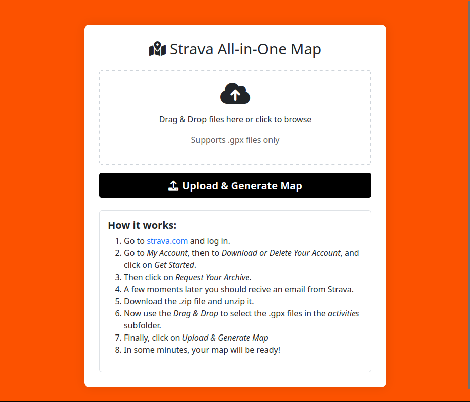
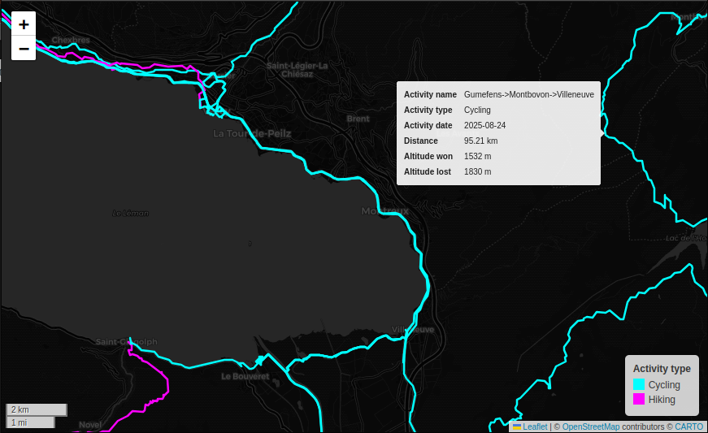

# strava-maps

strava-maps is a tiny Flask app that lets you visualize the itineraries of all your Strava activities locally, without sharing your data with third parties, and free of charge. It is your data, after all! 

## Installation

Clone the repository, create a Python venv, install the required packages, and run the flask app.

## Usage

```bash
flask --app src/main.py run
```

## Screenshots

### Landing page


### Map



## Contributing

No point of contributing into such a small project. But go ahead if you please!

## License

[The Unlicense](https://unlicense.org/)
